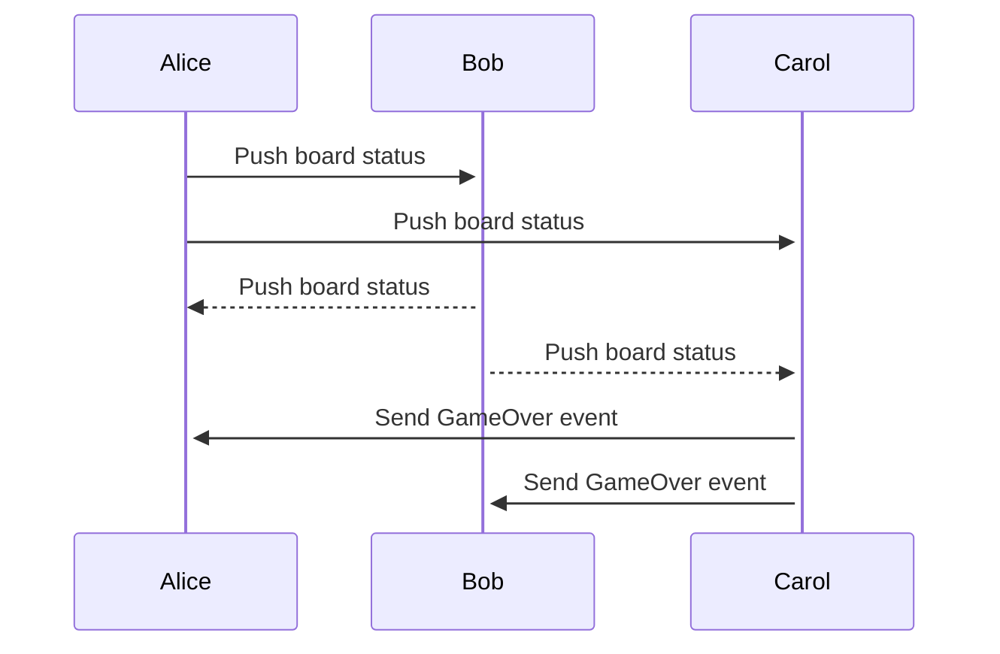
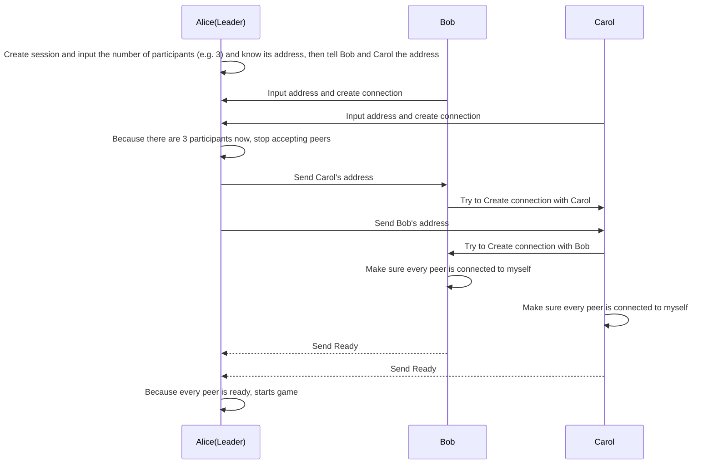

# Design doc for vkg/tetris

このドキュメントでvkg/tetris (以下 vtetris と呼称する) プロジェクトの設計並びにシステムアーキテクチャを示す。

## 目的

vtetrisを開発する目的は、以下のゴール全てを満たすためである。

* コマンドラインからプレイ可能である
* 最大5人までのオンライン対戦が可能である

上記両方を満たすテトリスは商用・OSS共に現状無いものと思われる (筆者調べ) 。

## ゲームとしての仕様

テトリスは昔から人々に広く普及しているゲームであるため、ここには細かいルールは記載しない。

### ゲームの勝敗

vtetrisは対戦が可能なため、勝敗の概念が存在する。
vtetrisにおける勝利は、他の全てのプレイヤーがゲームオーバーとなることによって決まる。

### 一人プレイ

vtetrisは対戦が可能であるが、一人でのプレイも可能とする。その場合はプレイヤーがゲームオーバーになるまでゲームは終わらないものとする。

### テトリミノ

テトリミノはFANDOMのガイドライン[^1]に従い、以下の通りとする。() 内はANSIエスケープコードに定義された8-bitカラーコード[^2] を示す。
  - I型 - 薄青 (14)
  - O型 - 黄 (11)
  - T型 - 紫 (13)
  - S型 - 緑 (10)
  - Z型 - 赤 (9)
  - J型 - 青 (12)
  - L型 - 橙 (208)
  
### レベル

vtetrisにはレベルの概念がある。レベルは0から始まり、20まで存在する。ゲーム開始時は全てのプレイヤーはレベル0から始まる。2分経過ごとにレベルが1上がる。
レベルが上がると、テトリミノの落下速度が変化する。各レベルでの落下速度は以下の表の通りとする。

|レベル|テトリミノが1段落下するのにかかる時間 (ms)|
|:---|:---|
|0|1050|
|1|1000|
|2|950|
|3|900|
|20|50|
|n|1050 - 50n|

### 得点
vtetrisの得点の付け方はFANDOMのガイドライン[^3]に準じ、以下の通りとする。以下の表の1~4は、同時に消去したラインの数を示している。

|レベル|1|2|3|4|
|:---|:---|:---|:---|:---|
|0|40|100|300|1200|
|1|80|200|600|2400|
|2|120|300|900|3600|
|9|400|1000|300|12000|
|n|40 * (n+1)|100 * (n+1)|300 * (n+1)|1200 * (n+1)|

### 次に落ちてくるミノ

ボード上には「次に落ちてくるミノ」が常に表示されており、その時ボード上にあるミノの位置が確定すると、そのミノが次にボード上に現れるものとする。

### 対戦

vtetrisにおける対戦機能とは、2人から5人までのプレイヤーで同時にゲームを始められる機能を意味し、以下の要件を満たす。

* 6人目のプレイヤーがセッションに参加しようとすると、参加しようとしたプレイヤーにはエラーが表示され参加できない
* 対戦中は他のプレイヤーのボード及びミノの動きが自分の画面に表示される
* ゲームは同時に始まっているため、レベルアップするタイミングも同じである
* ゲームオーバーになったプレイヤーのボードには「ゲームオーバー」の文字を表示するなど、ゲームオーバーになったことをプレイヤーが理解できるようになっている

## システムとしての仕様

テトリスゲームの実装については省略する。

### 概要

vtetrisは低レイテンシで軽快に動作する必要がある。また、ゲームとしての面白さを損なわないために、実行時のエラーを可能な限り防ぐ必要がある。また、対戦時にはネットワーク通信が頻繁に発生するが、その際にも可能な限り遅延なく処理ができることを保証する必要がある。
以上の理由により、プログラミング言語にはGo[^4]を採用する。
vtetrisの参加者 (本セクションでは「ピア」と呼称する)同士の通信には、低遅延でかつコネクションを張ったままにできるgRPC[^5]のunary RPCを採用する。

### アーキテクチャ

以下に、システムの簡易的なアーキテクチャ図を示す。以下の図はAlice、Bob、Carolがプレイヤーとして存在し、Carolがゲームオーバーになったことを示す。


<details><summary>code</summary><div>



</div></details>

vtetrisには中央サーバは存在しない。各ピアがサーバ及びクライントになることで、自律分散型のテトリスネットワークを構成する。
各ピアは他の全てのピアとコネクションを確立し、自身のミノ・ボードの状態を他の全てのピアにプッシュする。
受け取った情報は各クライアントが自身の画面に反映することで、全てのピアの状態をリアルタイムで各自のコンソールに描画することが可能になる。

### 通信プロトコル

前述の通り、通信プロトコルにはgRPCを採用し、ポートには5000をデフォルトでバインドするものとする。ただし、5000番を開放できないユーザのために、任意のポートをコマンドライン引数として指定できる機能の実装を必須とする。

### セッションとピア

vtetrisには「セッション」の概念が存在する。セッションは、「対戦」を意味し、ひとつのセッションに1~5のピアが所属する。
プレイヤーはvtetrisのプロセスを起動すると、セッションを作成するかすでにあるセッションに参加することを選択できる。

#### セッション作成

セッション作成が選択されると、セッションを作成したピアがサーバーを起動し、自身のグローバルIPアドレスとサーバのポートを画面に表示する。このアドレスはプレイヤーが対戦したいプレイヤーに自身で共有することを想定している。

セッションを作成したピアは、当該セッションにおいて「リーダー」となり、以下をセッション内の他のピアに対して行う必要がある。

* セッション参加人数の広告
* セッション参加者全ての参加者のピア

#### セッションに参加

vtetrisにおいて、セッションの参加者は「フォロワー」と呼ばれる。
セッションに参加するためにはセッション作成者から共有されたIPアドレスとポートが必要である。
参加者は、IPアドレスとポートをセッション参加時に入力し、リーダーとコネクションを確立する。その後、他のフォロワーの情報をリーダーから受け取り、描画の準備を行う。

以下に、リーダーとフォロワーの通信シーケンスを示す。なお、図ではフォロワーのピアは2つだけ書かれているが、実際は複数存在する (4まで) 可能性がある。


<details><summary>code</summary><div>



</div></details>

### 認証

実装の簡素化とレイテンシ低減のために、認証の機構は実装しない。
RPCをコールする際に、各ピアはピアIDを送信し、各クライアントはそれを信用するものとする。

### RPC詳細

このセクションでは、各ピアが相互通信に使用するRPCについて説明する。記載フォーマットについてはgRPCで採用されるフォーマットであるProtocol Buffers[^6]に従っている。

```proto
syntax = "proto3";

service Vtetris {
  rpc SendMeta(SendMetaRequest) returns (google.protobuf.Empty);
  rpc SendReady(SendReadyRequest) returns (google.protobuf.Empty);
  rpc SendUpdate(SendUpdateRequest) returns (google.protobuf.Empty);
  rpc SendGameOver(SendGameOverRequest) returns (google.protobuf.Empty);
}

message SendMetaRequest {
  message Peer {
    string id = 1;
    string address = 2;
    int64 port = 3;
  }
  repeated Peer peers = 1;
}

message SendReadyRequest {
  string peer_id = 1;
}

message SendUpdateRequest {
  enum Color {
    COLOR_CYAN = 0;
    COLOR_YELLOW = 1;
    COLOR_PURPLE = 2;
    COLOR_GREEN = 3;
    COLOR_RED = 4;
    COLOR_BLUE = 5;
    COLOR_ORANGE = 6;
  }
  enum Mino {
    MINO_I = 0;
    MINO_O = 1;
    MINO_T = 2;
    MINO_S = 3;
    MINO_Z = 4;
    MINO_J = 5;
    MINO_L = 6;
  }
  message Block {
    int64 x =1; // coordinate
    int64 y = 2;
    Color color = 3;
  }
  message Mino {
    Mino mino = 1;
    int64 x = 2;
    int64 y = 3;
  }
  string peer_id = 1;
  repeated Block blocks = 2;
  Mino mino = 3;
}

message SendGameOverRequest {
  string peer_id = 1;
}
```

### その他

* 視認性のために、ミノには前述の色をつけて描画することを必須とする。

## 機能拡張

テトリスはシンプルなゲームであるために様々な機能拡張が考えられる。以下にはvtetrisに将来的に実装される可能性がある機能を示す。

* ゲーム開始時にレベルを選択可能にする
* ゴーストブロック (ミノを操作中にそのまま下に落としたときの表示位置) の実装
* 他プレイヤーが「テトリス」(4ラインまとめて消去) した際に、他プレイヤーのミノを4段増やす
* 「Tスピン[^7]」の実装
* 「次に落ちてくるミノ」を3つまで表示する
* 「ホールド」 (「次に落ちてくるミノ」を退避させ、任意のタイミングで使用できる) の実装
* 「コンボ」 (n回連続で消去し続けるとボーナスポイントが発生する) の実装

## その他

### ライセンス

vtetrisはオープンソースソフトウェアとしてGitHubを利用して公開し、ライセンスはMITとする。
公開用のリポジトリには [github.com/vkg/tetris](https://github.com/vkg/tetris) を使用する。

[^1]: https://tetris.fandom.com/wiki/Tetris_Guideline
[^2]: https://en.wikipedia.org/wiki/ANSI_escape_code#8-bit
[^3]: https://tetris.fandom.com/wiki/Scoring
[^4]: https://golang.org
[^5]: https://grpc.io/docs/guides/concepts/
[^6]: https://developers.google.com/protocol-buffers
[^7]: https://www.mintscore333.com/entry/2017/08/14/225755
